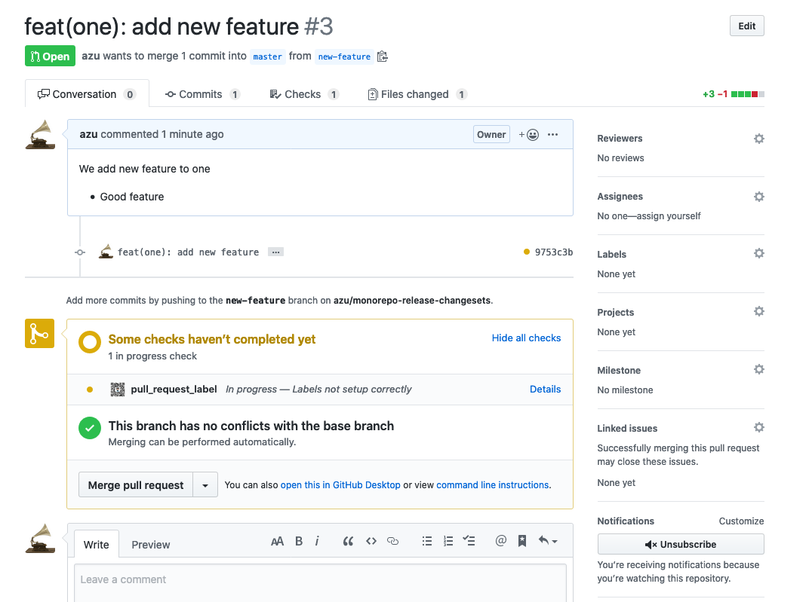
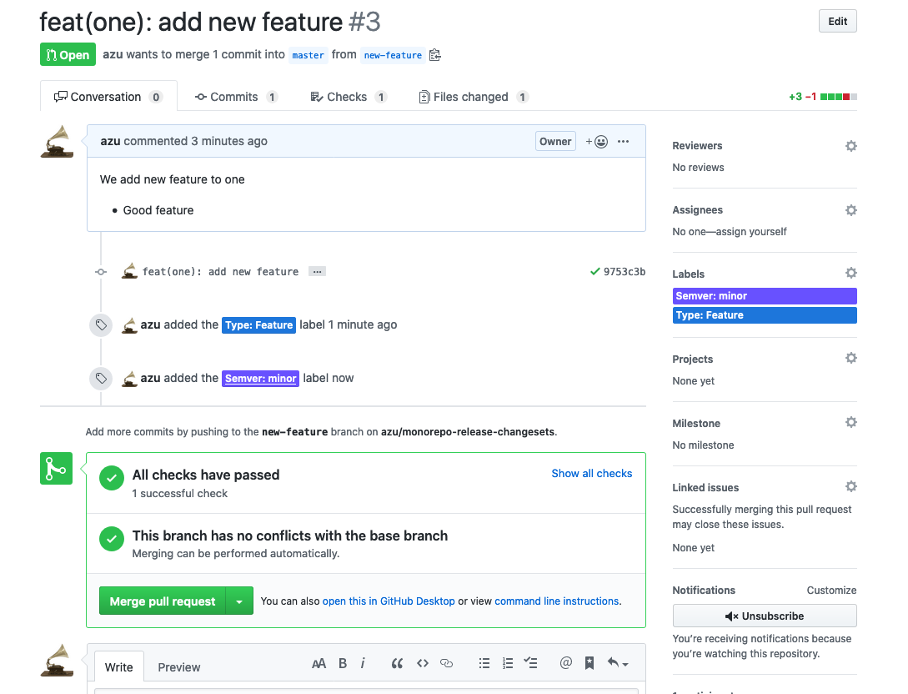

# monorepo + changesets Release FLow

This is an example of monorepo release flow.

This monorepo use [yarn](https://github.com/yarnpkg/yarn) + [lerna](https://github.com/lerna/lerna) + [changesets](https://github.com/atlassian/changesets) + [GitHub Actions](https://github.co.jp/features/actions). 

Related:

- [atlassian/changesets: 🦋 A way to manage your versioning and changelogs with a focus on monorepos](https://github.com/atlassian/changesets)
- [azu/pr-to-changesets: Create changesets content from Pull Request.](https://github.com/azu/pr-to-changesets)

Another monorepo release flow:

- [azu/lerna-monorepo-github-actions-release: Lerna + monorepo +GitHub Actions Release Flow](https://github.com/azu/lerna-monorepo-github-actions-release)
    - GitHub Actions + Lerna
- [lernaでのmonorepoにおけるリリースフロー(Fixed/Independent) | Web Scratch](https://efcl.info/2019/01/26/monorepo-release-flow/)
    - Lerna manually

## Purposes

- User can control packages versions
- Draft changelog before publishing - integrate with [changesets](https://github.com/atlassian/changesets)
- **GitHub PR's Label Based** version control - use [pr-to-changesets](https://github.com/azu/pr-to-changesets)
- Publish tag and packages from CI
- Support **independent mode**

## Roles and Works

1. [Person] Develop and Submit Pull Request
2. [Team] Review Pull Request and attach **Version Label**
3. [CI] Create Release Pull Request
4. [Team] Merge Release Pull Request
5. [CI] Publish

## Release Flow

0. [Local] Checkout branch: `git checkout release/<uniq>`
1. [Local] Submit to Pull Request
2. [GitHub] Review Pull Request and attach a label one of `Semver: {major, minor, patch}`
3. [GitHub] Merge Pull Request
4. [CI] [pr-to-changesets](https://github.com/azu/pr-to-changesets) create `.changeset/*.md` from Pull Request
     - The changed packages in the Pull Request, add it as `Semver: <version>` into [`.changesets`'s log](https://github.com/atlassian/changesets/blob/master/docs/detailed-explanation.md)
     - It means that each version are controlled by the label of Pull Request.
     - It work with [Lerna's Independent mode](https://github.com/lerna/lerna#independent-mode). 
     - Fore more details, see [pr-to-changesets](https://github.com/azu/pr-to-changesets) and [changesets](https://github.com/atlassian/changesets)
     - Implementation in [.github/workflows/pr-to-changesets.yml](.github/workflows/pr-to-changesets.yml)
5. [CI] Submit Version up Pull Request
    - When another pull request is merged, Update the Version up Pull Request
    - Implementation in [.github/workflows/publish.yml](.github/workflows/publish.yml)
6. [GitHub] Review Version up Pull Request and Merge Pull Request
7. [CI] Release to npm
    - Each packages are published as `Semver: <version>`
    - Implementation in [.github/workflows/publish.yml](.github/workflows/publish.yml

### An Example of Work Flow 

1. [Person] Submit Pull Request: [fix(packages): add test by azu · Pull Request #1 · azu/monorepo-release-changesets](https://github.com/azu/monorepo-release-changesets/pull/1)

2. [Team or Person] add Label for versioning

3.  [CI] Create Version up Pull Request: [Version Packages by github-actions · Pull Request #5 · azu/monorepo-release-changesets](https://github.com/azu/monorepo-release-changesets/pull/5)

4. [Team] Review it and Merge It

5. [CI] Publish update packages to npm registry

### Notes

GitHub Label like `Semver: patch` is user defined label.
It means that you can use another labels like `Type: Feature` and `Type: BREAKING CHANGE`.

- Semver Labels is defined in [.github/pr-to-changesets.json](.github/pr-to-changesets.json).
- If you want to check required label, you can use these bot
    - [fossapps/pr_label_enforcer: https://github.com/marketplace/pr-label-enforcer](https://github.com/fossapps/pr_label_enforcer)
    - [sugarshin/required-labels-action: A GitHub Actions that automated label checking for pull requests](https://github.com/sugarshin/required-labels-action)
    - This repository use [pr_label_enforcer) and define the labels in [.github/pr_labels.yml](.github/pr_labels.yml)

## Changelog

See [Releases page](https://github.com/azu/monorepo-release-changesets/releases).

## Running tests

Install devDependencies and Run `npm test`:

    npm test

## Contributing

Pull requests and stars are always welcome.

For bugs and feature requests, [please create an issue](https://github.com/azu/monorepo-release-changesets/issues).

1. Fork it!
2. Create your feature branch: `git checkout -b my-new-feature`
3. Commit your changes: `git commit -am 'Add some feature'`
4. Push to the branch: `git push origin my-new-feature`
5. Submit a pull request :D

## Author

- [github/azu](https://github.com/azu)
- [twitter/azu_re](https://twitter.com/azu_re)

## License

MIT © azu
